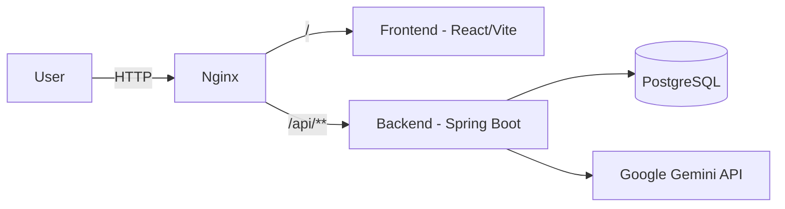

# Introduction

## What is CareerPilot

CareerPilot is an AI-assisted career platform that helps job seekers prepare for their next
role. It combines three workflows on top of a shared AI infrastructure:

1. **AI Chat** — a career-focused conversation assistant with user context and instructions.
2. **CV Analysis** — CV review, and CV-to-Job-Description (JD) match analysis.
3. **Mock Interview** — configurable mock interviews with AI-generated questions and evaluation.

The project is intentionally scoped as a portfolio/CV project: broad enough to demonstrate real
AI engineering (prompt management, context management, structured output, stateful workflows),
but deliberately avoiding scope creep (no RAG, no multi-agent orchestration, no voice interview,
etc. — see [docs/06-roadmap-scope.md](./06-roadmap-scope.md) for the full rationale).

## Who it serves

- **Primary user**: a single developer/job-seeker using the platform for their own CV review
  and interview practice (MVP assumes a single-user or basic-auth development account).
- **Future users** (V1+): multiple registered users with isolated data, via login/register.

## Tech Stack

| Layer      | Technology |
|------------|------------|
| Backend    | Java 21, Spring Boot 4 (`be/`) |
| Frontend   | React 19, TypeScript, Vite (`fe/`) |
| Database   | PostgreSQL (`pgvector` image, though vector search itself is out of MVP scope) |
| AI Model   | Google Gemini |
| Reverse Proxy | nginx (routes `/` to `fe`, `/api/**` to `be`) |
| Orchestration | Docker Compose (local dev / self-hosted) |

## High-Level Architecture



See also:
- [docs/02-use-cases.md](./02-use-cases.md) for the concrete use cases and implementation order.
- [docs/03-frontend-architecture.md](./03-frontend-architecture.md) for the `fe/` folder layout.
- [docs/04-backend-architecture.md](./04-backend-architecture.md) for the `be/` package layout.
- [docs/05-testing-strategies.md](./05-testing-strategies.md) for how both sides are tested.
- [docs/06-roadmap-scope.md](./06-roadmap-scope.md) for the full MVP/V1/V2/Advanced scope.

## Setup

### Prerequisites
- Java 21 (backend)
- Node.js (frontend, Vite 8 / React 19 compatible version)
- Docker + Docker Compose (for the full stack, or just for PostgreSQL locally)
- A Google Gemini API key

### Environment variables

Copy `.env.example` to `.env` at the repo root and fill in:
- `POSTGRES_DB`, `POSTGRES_USER`, `POSTGRES_PASSWORD`, `POSTGRES_PORT`
- A Gemini API key variable (not yet present in `.env.example` — to be added when Gemini
  integration is implemented; see [docs/06-roadmap-scope.md](./06-roadmap-scope.md) section 2).

### Run the full stack

```powershell
docker compose up
```

This starts `pg` (PostgreSQL), `be` (Spring Boot), `fe` (built frontend), and `nginx` on port 80.

### Run backend only (dev mode)

```powershell
be/mvnw spring-boot:run
```

Requires a reachable PostgreSQL instance and the `SPRING_DATASOURCE_*` environment variables
(see `be/src/main/resources/application.yml`).

### Run frontend only (dev mode)

```powershell
cd fe
npm install
npm run dev
```
