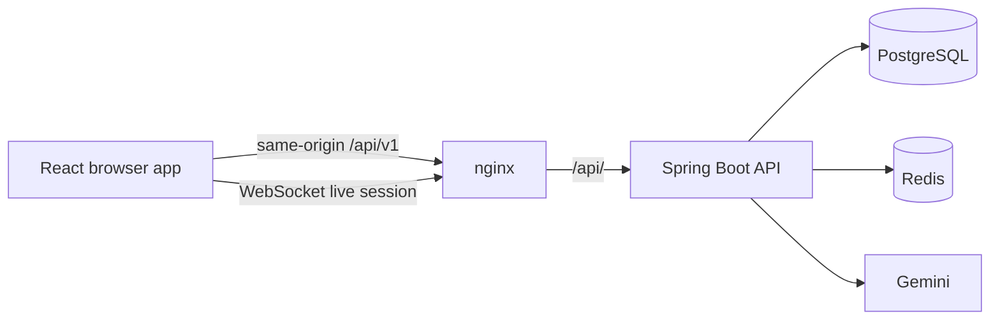

# Frontend Architecture

This is the general entry point for the React application. It defines the boundaries, visual
direction, dependency policy, and backend integration rules. Detailed implementation slices live
in [03-1-frontend-implementation-plan.md](./03-1-frontend-implementation-plan.md).

The current frontend is only the Vite scaffold in `fe/src/main.tsx` and `fe/src/App.tsx`. The
backend already provides the P0 auth, profile, chat, CV, and live-interview contracts, but no
frontend feature has been implemented yet. Completion in this document means a user-visible,
tested frontend workflow, not merely a backend endpoint existing.

## Architecture Shape

Use a feature-first React application with a thin app shell and a deliberately small shared layer:

```text
fe/src/
|- main.tsx                         # React entry point
|- App.tsx                          # providers and route root
|- app/
|  |- router.tsx                    # route definitions and guards
|  |- layout/                       # authenticated shell and navigation
|  |- providers/                    # auth/session and global UI providers
|  `- pages/                        # cross-feature route-level states
|- config/
|  |- env.ts                        # validated VITE_* configuration
|  `- constants.ts
|- features/
|  |- auth/                         # registration, login, verification, recovery
|  |- chat/                         # conversations, messages, profile settings
|  |- cv-analysis/                  # upload, review, JD match, history
|  `- interview/                    # catalog, setup, live session, report
|- shared/
|  |- api/                          # HTTP client, ApiResponse, auth retry
|  |- components/                  # accessible primitives only
|  |- hooks/                        # genuinely cross-feature hooks
|  |- types/                        # shared transport and session types
|  `- utils/                        # pure formatting and validation helpers
`- styles/                          # tokens, reset, global layout rules
```

Each feature owns its route components, API functions, hooks, view models, and feature types. A
shared component is promoted only after at least two features need the same behavior. Components
must never call `fetch` directly; all network traffic goes through `shared/api/`.

## Runtime Boundaries



- In Docker, nginx serves the built frontend and proxies `/api/` to the backend, so the preferred
  production shape is same-origin.
- In Vite development, configure a proxy for `/api` and `/api/v1/interviews` WebSocket traffic to
  the backend. This keeps the refresh cookie same-site and avoids an unnecessary CORS design.
- The browser stores only the short-lived access token. The backend owns the httpOnly refresh
  cookie; JavaScript must not read, decode, or persist it.
- The shared HTTP client sends `Authorization: Bearer <accessToken>` and `credentials: 'include'`.
  One 401 may refresh and retry once. A second 401 clears session state and routes to login. A 403
  routes to a dedicated forbidden page.
- Every JSON response is parsed as `ApiResponse<T>` with `timestamp`, `statusCode`, `message`, and
  `result`. Validation errors are `ApiResponse<Record<string, string>>`; business errors have a
  null result. Feature APIs unwrap successful `result` values only after checking the wrapper.
- WebSocket messages use typed event unions. The live interview state remains server-authoritative
  for deadlines, phases, counters, ownership, and completion. The frontend uses the backend's
  interim `?accessToken=` connection contract behind one adapter so it can later move to a ticket.
- HTTP feature modules map to `/api/v1/auth/**`, `/api/v1/users/me/profile`,
  `/api/v1/conversations`, `/api/v1/cvs`, and `/api/v1/interviews`. Catalogs and session setup/report
  use HTTP; only the active interview turn uses WebSocket.

## Visual Direction

CareerPilot's visual direction is "Quiet Technical": neutral surfaces, one restrained accent, and
monospace only for numeric/status data. This is a tool used under stress (job search, interview
prep) with dense, decision-relevant content (scores, skill gaps, live timers) — clarity and trust
beat visual flourish. The full token list, component inventory, and anti-patterns are enforced in
[frontend-design.instructions.md](../.github/instructions/frontend-design.instructions.md); this
section only records the direction and why.

- Typography: one sans (Inter) for all UI text and headings, everywhere including auth pages — no
  separate display/serif face. JetBrains Mono is used only for numeric/status data: scores,
  countdown timers, session/record IDs, and code blocks.
- Palette: neutral canvas/surface/border/text scale, a single indigo/blue accent, and semantic
  color pairs (success/warning/danger/info) with a fixed meaning: success = matched/passed,
  warning = missing-but-optional/cooldown/timeout, danger = destructive/expired/integrity flag,
  info = neutral status. Color is never the only signal; pair it with an icon or label.
- Dark mode is a first-class requirement from the start, not a later addition: it defaults to the
  visitor's `prefers-color-scheme` and can be manually overridden, persisted via `ThemeProvider`/
  `useTheme` (`fe/src/app/providers/`), which sets `data-theme` on the document root.
- Layout: authenticated pages use a fixed dark navigation rail on desktop (independent of the
  light/dark toggle, like an IDE activity bar) and a compact top/bottom pattern on mobile. Main
  content is an unframed workspace; cards are reserved for repeated records, results, and dialogs,
  with a 1px border and no shadow — shadow is reserved for one overlay elevation level (dropdowns/
  modals) only.
- Chat prioritizes a compact conversation list and a flat message flow (no heavy bubble chrome)
  with a persistent composer. CV pages pair document input with scannable analysis cards (pill
  chips for matched/missing skills, a monospace score). Interview pages prioritize the current
  interviewer message, a monospace countdown, phase indicator, and connection state; integrity
  events render as a quiet inline log, never an alarming style.
- Motion is purposeful: route entrance, result reveal, connection transitions, and countdown
  warning states. Respect `prefers-reduced-motion` and never use animation to hide loading/error
  states.

## Dependency Policy

The current dependencies are React 19, React DOM, TypeScript, Vite, and ESLint. The planned baseline
should be installed before feature implementation so later workflows do not require migrations:

| Need | Preferred choice | Timing |
|---|---|---|
| Need | Dependencies | Responsibility |
|---|---|---|
| Routing | `react-router-dom` | URL routes, nested layouts, protected routes, redirects, and route-level error states |
| Styling | `clsx` plus CSS Modules and global CSS | Conditional class composition; CSS Modules own component styles and global CSS owns tokens/reset |
| HTTP | `axios` | One configured client with `/api` base URL, `withCredentials`, bearer headers, wrapper parsing, and interceptors |
| Server state | `@tanstack/react-query` | Query/mutation caching, invalidation, request status, deduplication, and stale-data handling |
| WebSocket | `react-use-websocket` | Connection lifecycle, reconnect policy, send/receive helpers, and a typed interview adapter |
| Markdown | `react-markdown`, `rehype-sanitize` | Render assistant markdown while sanitizing untrusted model output |
| Testing runtime | `vitest`, `jsdom` | Fast Vite-native unit/component test execution in a browser-like DOM |
| Testing utilities | `@testing-library/react`, `@testing-library/user-event`, `@testing-library/jest-dom` | Observable rendering, realistic interaction, and accessible DOM assertions |
| Icons | `lucide-react` | Consistent accessible icons in controls, navigation, statuses, and actions |

These are the recommended package names for `fe/package.json`. `@types/*` packages should be added
only when a selected dependency needs them; the listed packages provide their own TypeScript types.
Testing packages belong in `devDependencies`; the other packages belong in `dependencies`.

`clsx` does not replace CSS. Keep design tokens, responsive rules, focus states, and reduced-motion
rules in CSS. React Query is server-state management, not a replacement for local UI state or the
auth session boundary. Do not add another global state library, component framework, or charting
library. API keys and backend secrets never belong in Vite variables.

## Delivery Map

The detailed plan uses the same use-case numbering as [02-use-cases.md](./02-use-cases.md).
Frontend status is tracked separately from backend completion:

| Slice | Frontend priority | Backend prerequisite | Outcome |
|---|---|---|---|
| Foundation and auth | P0 | Auth endpoints and JWT cookie flow | A usable protected shell |
| Chat and profile | P0 | Use cases 1.1-1.6 and profile API | Persisted career chat |
| CV analysis | P0 | Use cases 2.1-2.4 | Upload, review, match, history |
| Live interview | P0 | Revised 3.1-3.7 contract and WebSocket stability | Complete live session and report |
| Shared AI streaming | P1 | Use case 0.5 | Streaming client states |
| Chat quality | P1 | Use cases 1.7-1.9 | Markdown, retry, edit, intent, summaries |
| CV depth | P1/P2/P3 | Use cases 2.5-2.8 | More formats, scoring, evidence, tailoring |
| Interview depth | P1/P2/P3 | Use cases 3.8-3.10 | Adaptive and fresh-knowledge workflows |
| Cross-feature context | P1/P2 | Use cases 4.1-4.3 | Explicit CV/interview context in chat |

Implementation order, route map, type contracts, state rules, and test gates are specified in
[03-1-frontend-implementation-plan.md](./03-1-frontend-implementation-plan.md).
